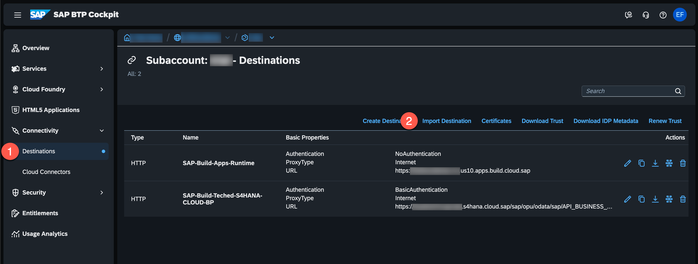
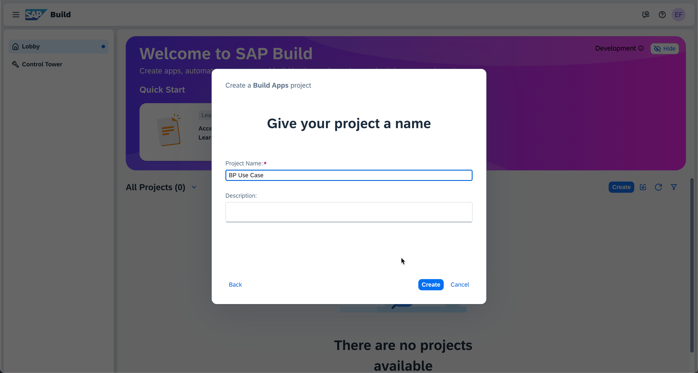
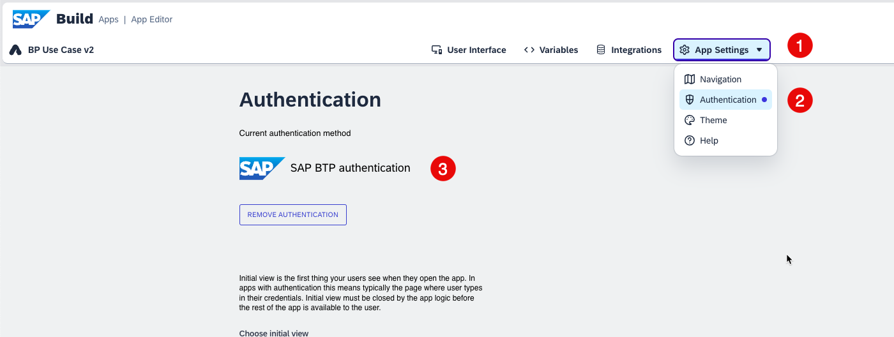
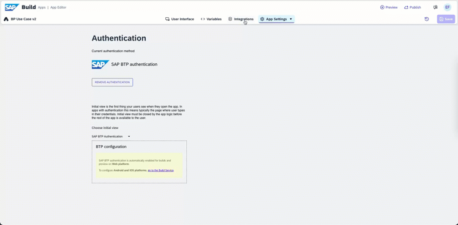
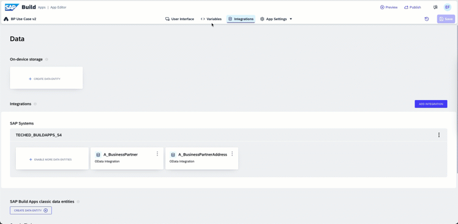
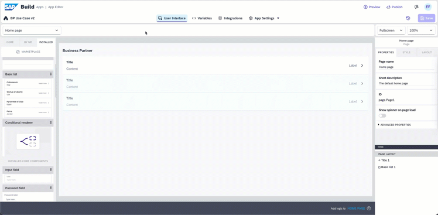
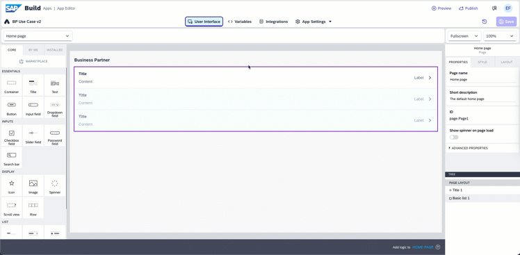
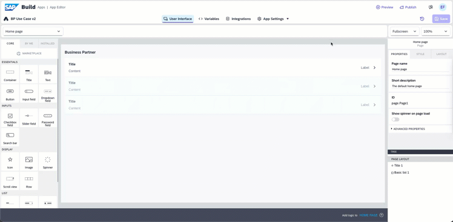
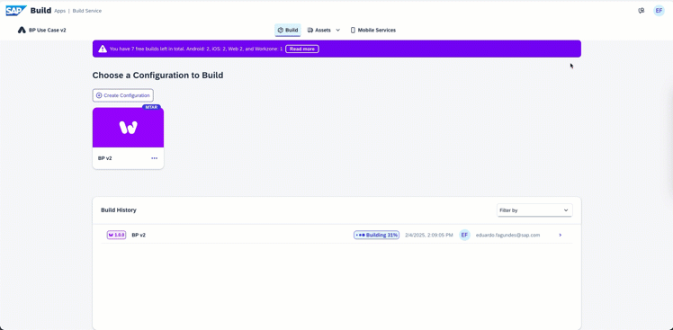
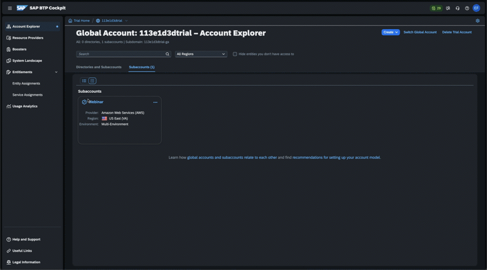

# Implementing a Use Case with SAP BTP

## Table of Contents

- [Step 1: Use Case - Enabling Remote Access to Business Partner Information](#step-1-use-case)
- [Step 2: Identify Necessary Services in SAP Discovery Center](#step-2-identify-necessary-services-in-sap-discovery-center)
- [Step 3: Set Up in SAP BTP Cockpit](#step-3-set-up-in-sap-btp-cockpit)
- [Step 4: Business Partner API](#step-4-business-partner-api)
- [Step 5: Create the Destination](#step-5-create-the-destination)
- [Step 6: Develop the Use Case with SAP Build Apps](#step-6-develop-the-use-case-with-sap-build-apps)
- [Step 7: Configure SAP Build Work Zone](#step-7-configure-sap-build-work-zone)
- [Step 8: Install & Configure SAP Mobile Start](#step-8-install--configure-sap-mobile-start)

## Step 1: Use Case - Enabling Remote Access to Business Partner Information

- **Objective**:

  - Enable remote access to our business partners' information, currently limited to the company network.

- **Need for Change**:

  - Overcome limitations hampering access to crucial information outside the office.
  - Particularly vital for the efficiency and responsiveness of the sales team in a mobile work environment.

- **Expected Benefits**:

  - Improved efficiency and responsiveness to client needs.
  - Facilitates remote access to the customer list.

- **Challenges**:

  - Addressing security concerns.
  - Necessary adjustments to the network infrastructure.

## Step 2: Identify Necessary Services in SAP Discovery Center

- Explore [SAP Discovery Center](https://discovery-center.cloud.sap/index.html). Here you can find:
  - [**Missions**](https://discovery-center.cloud.sap/missionCatalog/) | Implement your use cases on SAP Business Technology Platform, with step-by-step guidance and a well-established support from topic experts and SAP Community.
  - [**Architectures**](https://discovery-center.cloud.sap/refArchCatalog/) | Explore and understand different architecture patterns which can be implemented using Business Technology Platform services.
  - [**Seervices**](https://discovery-center.cloud.sap/viewServices) | Integrate and extend your solutions, optimize your business processes, and create an engaging digital experience using SAP Business Technology Platform services.
  - [**View Estimator**](https://discovery-center.cloud.sap/estimator/?commercialModel=cpea) | Estimate your project
- [Mission Keep the Core Clean Using SAP Build Apps with SAP S/4HANA](https://discovery-center.cloud.sap/missiondetail/4024/4228/)

## Step 3: Set Up in SAP BTP Cockpit

- Navigate to the[SAP BTP Cockpit](https://amer.cockpit.btp.cloud.sap/).
- Create a subaccount with a booster.
   
  - On the SAP BTP Cockpit select Boosters
  - Search for "build apps"
  - Select: Get Started with SAP Build Apps - Detailed Account Setup
- On the Booster screen you are going to see the details of the Booster. Press Start.
- A new dialog will popup to guide you on the creation of the subaccount and services.

  - 1: **Check Prerequisites**
     
    - Check if you have the authorization, IAS and entitlements.
    - Press Next.
  - 2: **Select Scenario**
       
      - Select if you want to create a new Subaccount or use a existing one.
      - Press Next.
  - 3: **Configure Subaccount**
         
    - Fill Subacoun Name
    - Choose Provider
    - Choose Region (*This service is not available in every region, maybe it won't list your existing subaccount*)
    - Subdomain (*This information can't be changed so it is important to choose something meaningful*)
    - Press Next.
  - 4: **Add Users**
     
    - Choose the IAS if you have more than one
    - Add the emails of administrators
    - Add the emails of developers
    - Press Next.
  - 5: **Review**
       
    - Review the informations provided
    - Press Finish

- The Booster will do all the necessary configurations for the use case implementation.
- _Important Reminder_ SAP Build Apps is not available in every region. So it is important to check if it is available on the region you want to create.
  [Discovery Center - SAP Build Apps](https://discovery-center.cloud.sap/serviceCatalog/sap-build-apps?region=all&tab=service_plan)

## Step 4: Business Partner API

- Search for the appropriate API for the use case on [SAP Business Hub Accelerator](https://api.sap.com/).
- For thi use case we are going to use [Business Partner (A2X)](https://api.sap.com/api/OP_API_BUSINESS_PARTNER_SRV/overview).

## Step 5: Create the Destination

- Back on the SAP BTP Cockpit.
   
  - 1: Select Destinations
  - 2: Import [TECHED_BUILDAPPS_S4](resources/TECHED_BUILDAPPS_S4)

## Step 6: Develop the Use Case with SAP Build Apps

These steps is to understand the basics steps to start the project.
You can download and import on the lobby the complete version [Business Partner.mtar](resources/Business%20Partner.mtar)

- **Access SAP Build Apps**
   
  - 1: Go to Instances and Subscriptions
  - 2: Click on SAP Build Apps
- **Start the development process for the use case**
  - In the Welcome Screen click on Create.
     
  - Select Build an Application.
     
  - Select Web & Mobile Application.
     
  - Fill the Project Name and click Create.
     

### Step 6.1: Authentication

By default the authentication is enabled. You can check this on:

1. Click on App Settings.
2. Select Authentication
3. Show the selected authentication method

### Step 6.2: Add Data

1. Click on Integrations Tab and click on Add Integration
2. Click on BTP Destinations
3. Select the destination
4. Click on INSTALL INTEGRATION
5. Select the entity
6. Click on ENABLE DATA ENTITY
7. Save

### Step 6.3: Design the User Interface

- Back to the User Interface
- Change the Title 1
- Remove the Text 1
- Click on MARKETPLACE
- Find basic list and install it
- Drag the Basic list to the UI
- Click configure to setup the compoment
- Select the BP entity
- Select the fields you want to show
- Save

### Step 6.4: Ready for the first test

- Click on Preview
- Click on Open preview portal
- Click OPEN on your app
- You should see your app running

### Step 6.4: Remove Navigation Header & Menu

- Click on App Settings
- Click on Navigation
- Let the Navigation header bar: Not enabled
- Set Navigation menu: No
- Save

### Step 6.6: Build & Deploy the app

- Build the App
   
  1. Click on Publish
  1. Click on Build and Deploy
  1. Click on Create Configuration
  1. Click on SAP Build Work Zone
  1. Set a name
  1. Click Create
  1. Select the configuration you've just created
  1. Add a version
  1. Click on BUILD
- Deploy the App
   
  1. Click on the last build on Build history section 
  1. Click on Deploy
  1. Login on BTP
  1. Do the process and authorize
  1. Select the Organization and Space of the Build Subaccount

## Step 7: Configure SAP Build Work Zone

1. On the cockpit go to Instance and Subscriptions
1. On Subscription -> Application -> SAP Build Work Zone, standard edition
    
1. On the SAP Build Work Zone:
1. Go to channel manager
    
   1. On Actions -> press Update content
1. Go to Content Manager:
     
   1. Click on Content Explorer 
   1. Select HTML5 Apps 
   1. Select the App Business Partner 
   1. Click on Add 
   1. Go back to the Content Manager 
   1. Click on Create and select Group 
   1. Fill the title and select the BP app 
   1. Click Save 
   1. Click on Create again and select role 
   1. Fill the title and add the BP app 
   1. Click Save
1. Go to SAP BTP Cockpit:
    
   1. Go to Security -> Role Collections 
   1. Select the role you created on work zone 
   1. Click on edit 
   1. Add you user on Users 
   1. Click Save
1. On the SAP Build Work Zone:
    
   1. Go to Site Directory
   1. Click on Create Site
   1. Fill the Site Name
   1. On the site page click on Edit
   1. On the Assignments on the right add the role you created
   1. Check if SAP Mobile Start is activated
   1. Click Save
   1. Click "<" (back)
   1. Click on the icon to open the site

## Step 8: Install & Configure SAP Mobile Start

1. On the SAP Work Zone:
    
   1. On the portal click on Your Initials -> Settings - > SAP Mobile Start Application
   1. Choose IOS or Android
   1. On Install there is a QR Code to the store to download the app
   1. On Register there is a QR Code to setup you SAP Mobile start
1. On the SAP Mobile Start Application:
    
   1. Read the end user license agreement and press Agree
   1. Click on Scan and point the camera to the Register QR Code
   1. Fill Email, Password and click continue
   1. Choose a Passcode
   1. Confirm the Passcode
   1. Choose if you want to enable Face Id
   1. Now you have the apps of you SAP Build Work Zone on your Mobile

## Step 9: Continue your learning journey with SAP Business Technology Platform

- [SAP Business Technology Platform (BTP) Onboarding Resource Center](https://support.sap.com/en/product/onboarding-resource-center/business-technology-platform.html)
- [SAP Build Apps](https://discovery-center.cloud.sap/serviceCatalog/sap-build-apps?region=all)
- [SAP Build Work Zone](https://discovery-center.cloud.sap/serviceCatalog/sap-build-work-zone-standard-edition?region=all)
- [Youtube - @sapdevs](https://www.youtube.com/@sapdevs)
- [learning.sap.com](https://learning.sap.com/)
- [developers.sap.com](https://developers.sap.com/)
